# Pizza Delivery App Clone

## Clone built using flutter and firebase
A fully functional 40+ screens pizza delivery app clone built using
Flutter and Firebase with  features such as authentication, picking delivery addresses, Item customization such as size, adding extra toppings, or removing any one of the toppings; payment gateway integration using Razorpay.

## App Features
### user is able to do
1. Signin,signup.
2. Pick a delivery address on the map.
3. Apply discount coupons to the cart's net amount or to specific items.
4. Customize the pizza's size and toppings.
5. Insert and remove items from the shopping cart.
6. Make payments using their preferred payment method.
7. View the order history.
8. To save the address for future use

## Lessons Learned
1. I learned how to integrate payment gateways.
2. Got familiar with using web hooks.
3. Learned about state management using the provider package
4. I learnt how to use Firebase authentication.
5. learned to write cloud functions.
6. I learned how to create and handle  Firebase Cloud Messaging notifications in app
7. I learned how to integrate maps and how to pick the user's location. using the geolocator package
8. learned about geoqueries and geohashes.
9. I learned how to use the Firestore database.
10. Learned how to write Firebase security rules.
11. I learned about the various approaches to dealing with environment variables in Flutter.
12. I learned how to use various other packages.

## Tech Stack

**Client:** Flutter

**Server:** Firebase

**Payment gateway:** Razorpay 

**Map Provider:** OpenStreetMaps 

## Screenshots

### Welcome screen and authentication page

    
    &ensp; &ensp;

  
     &ensp; &ensp;
 
  

### User registration page

  
     &ensp; &ensp;
 

  
     &ensp; &ensp;
 

  
     &ensp; &ensp;
 

  
     &ensp; &ensp;
 

### App home page
#### user location picking bottom sheet in home page

  
     &ensp; &ensp;
 

#### home page

   
     &ensp; &ensp;
 

   
     &ensp; &ensp;
 

#### not-found restaurant page

   
     &ensp; &ensp;
 

### Feature for picking an offer
#### apply an offer based on the overall cart price.

   
     &ensp; &ensp;
 

#### Choose items from the selected offer.

   
     &ensp; &ensp;
 

### Page for viewing items by category

   
     &ensp; &ensp;
 

   
     &ensp; &ensp;
 

   
     &ensp; &ensp;
 

### Pizza customization page

   
     &ensp; &ensp;
 

 
   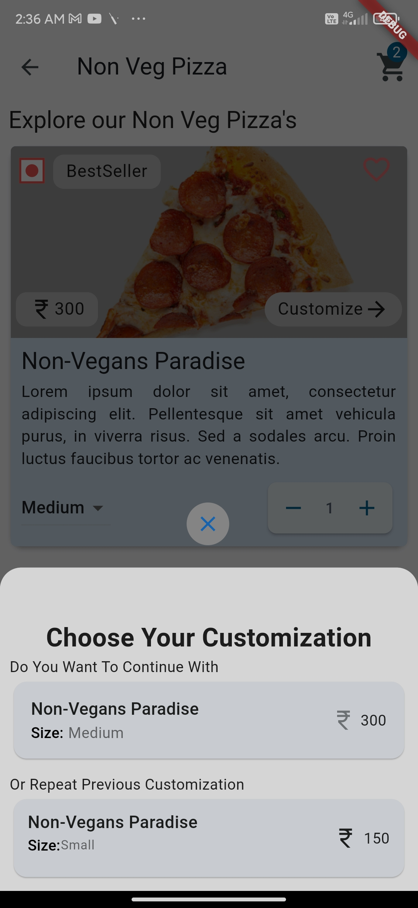
     &ensp; &ensp;
 

   
     &ensp; &ensp;
 

   
     &ensp; &ensp;
 

   
     &ensp; &ensp;
 

   
     &ensp; &ensp;
 

### Cart page

   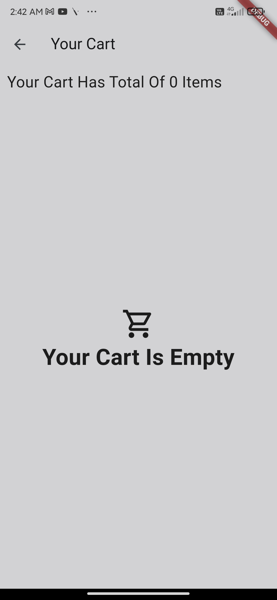
     &ensp; &ensp;
 

   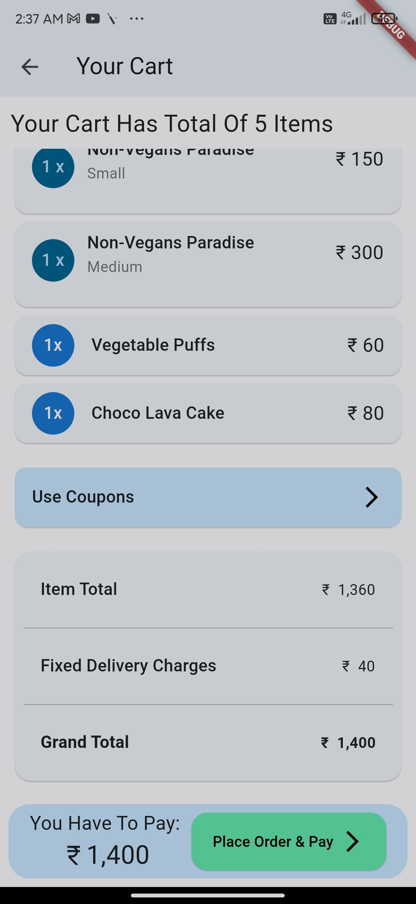
     &ensp; &ensp;
 

   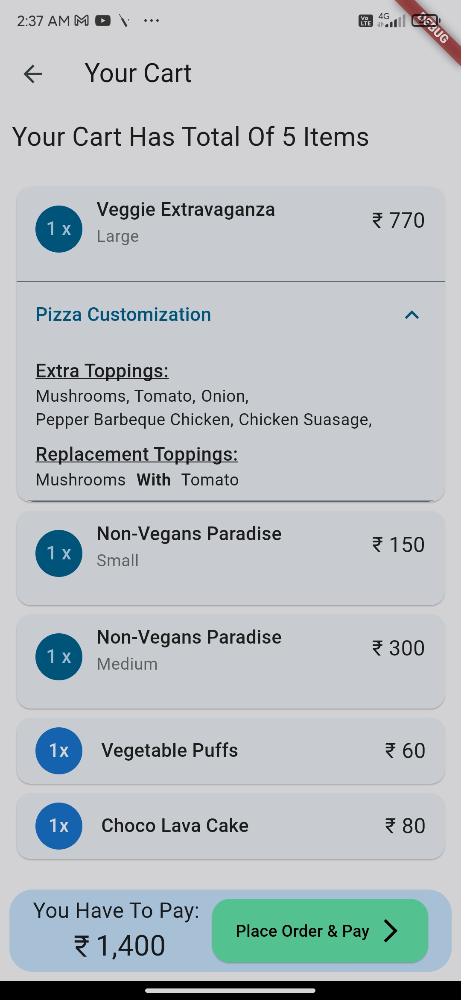
     &ensp; &ensp;
 

   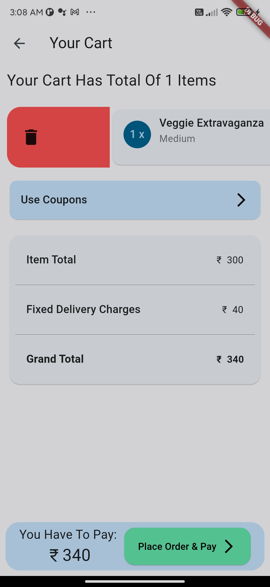
     &ensp; &ensp;
 

   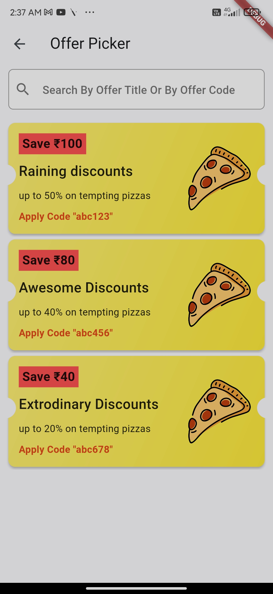
     &ensp; &ensp;
 

   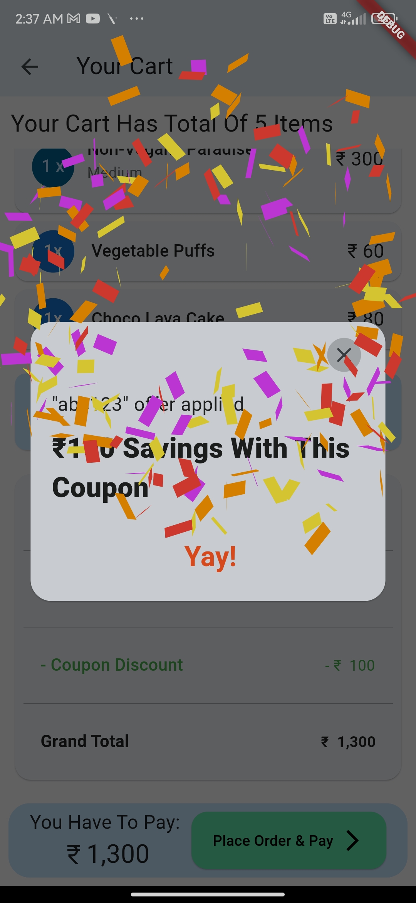
     &ensp; &ensp;
 

   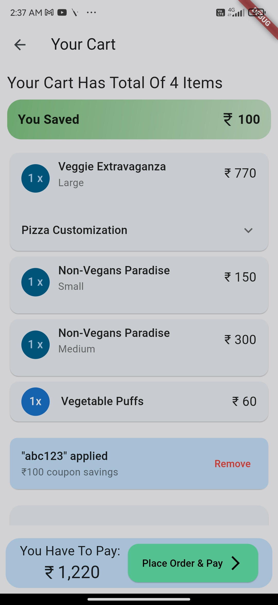
     &ensp; &ensp;
 

### Page for ordering and paying

   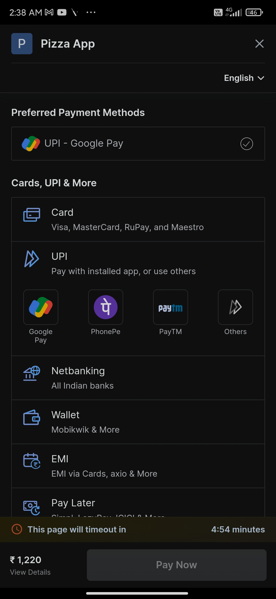
     &ensp; &ensp;
 

   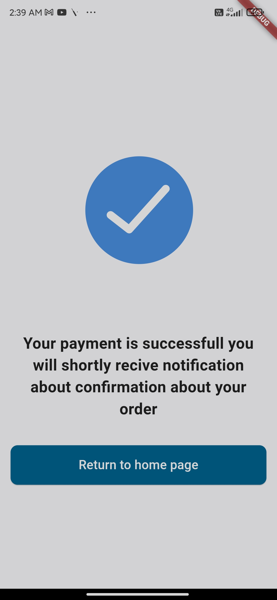
     &ensp; &ensp;
 

#### order confirmation notification

   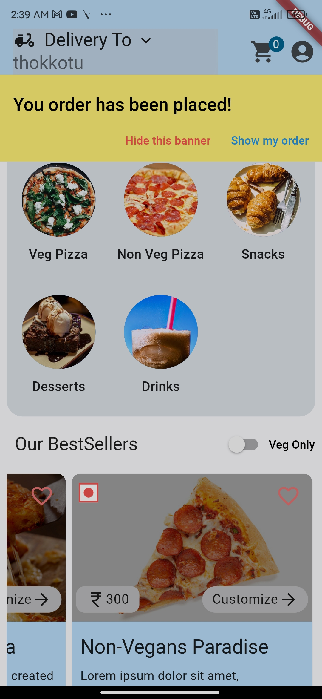
     &ensp; &ensp;
 

   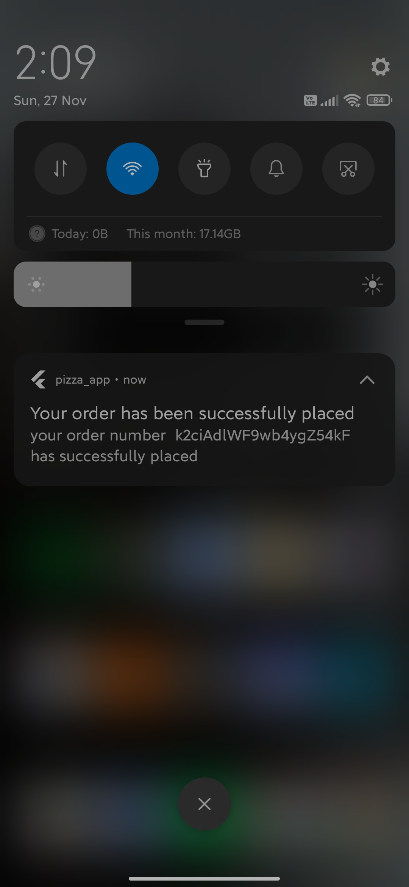
     &ensp; &ensp;
 

#### page for viewing ordered items
 
   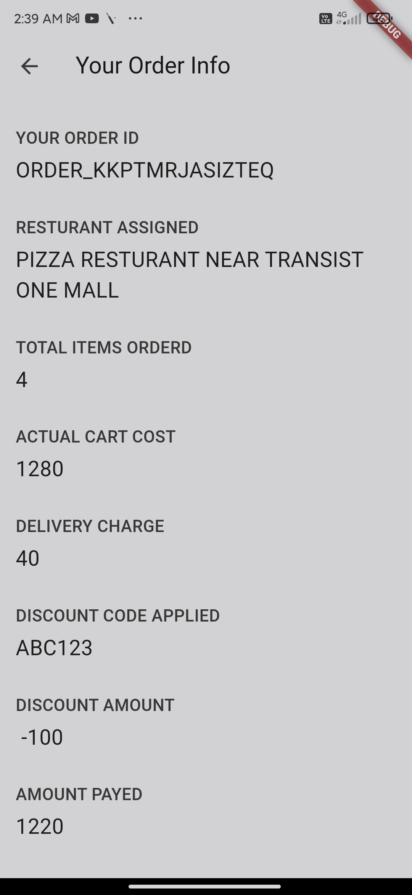
     &ensp; &ensp;
 

   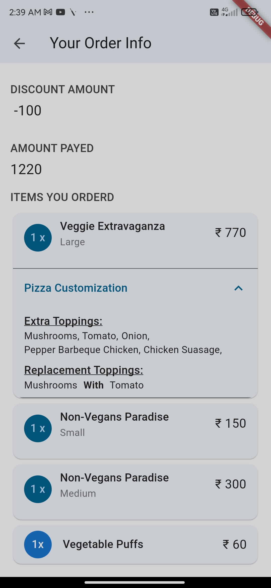
     &ensp; &ensp;
 

### Page for viewing a user's account

   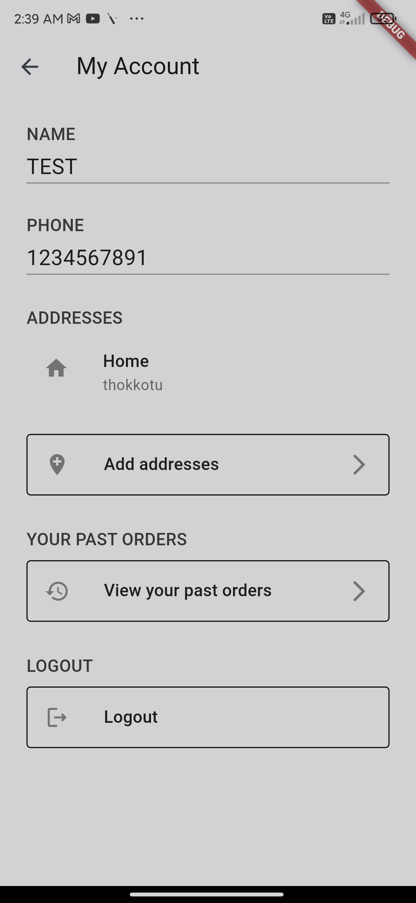
     &ensp; &ensp;
 

 
   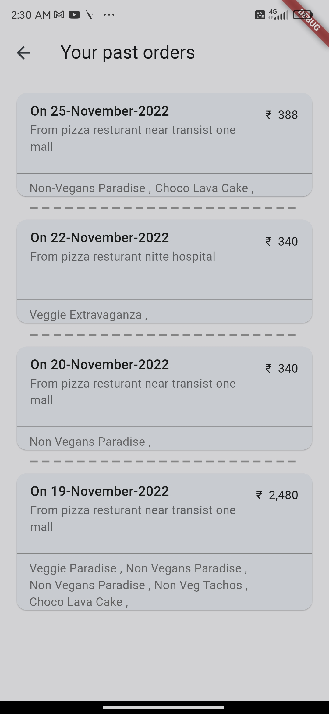
     &ensp; &ensp;
 

#### Add new address page
 
   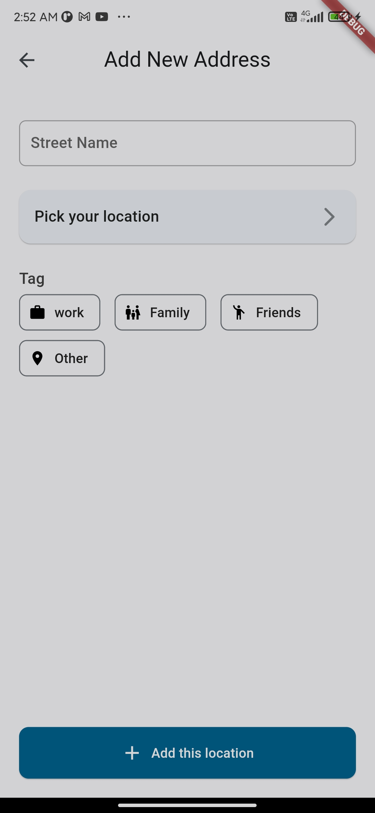
     &ensp; &ensp;
 

 
   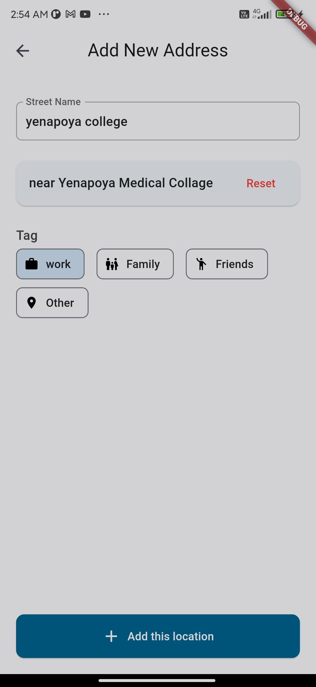
     &ensp; &ensp;
 

 
   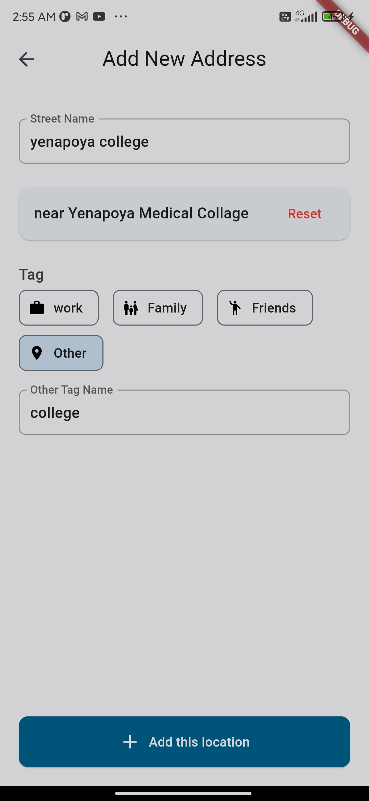
     &ensp; &ensp;
 

 
   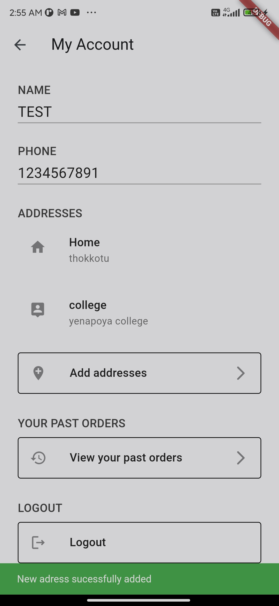
     &ensp; &ensp;
 

 
   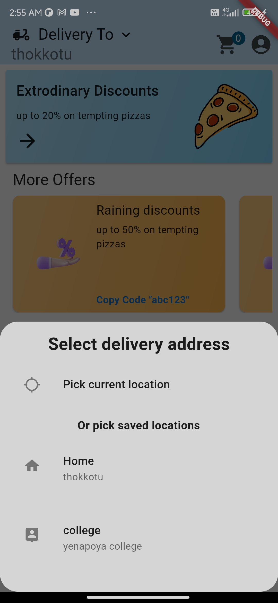
     &ensp; &ensp;
 

