# Pizza Delivery App Clone

## Clone built using flutter and firebase
A fully functional pizza delivery app clone built using
Flutter and Firebase provide features such as authentication, picking delivery addresses,
Item customization such as size, adding extra toppings, or removing any one of the toppings; payment integration using Razorpay; notification for confirmation of order
viewing order history and some other features

## Lessons Learned
1. I learned how to integrate payment gateways.
2. Learn how to handle web hooks.
3. learned about state management using the provider package
4. I learned how to use Firebase authentication.
5. learned to write cloud functions.
6. I learned how to handle notifications from Firebase Cloud Messaging.
7. I learned how to integrate maps and how to pick the user's location. using the geolocator package
8. learned about geoqueries and geohashes.
9. I learned how to use the Firestore database.
10. learned how to write Firebase security rules.
11. I learned about the various approaches to dealing with environment variables in Flutter.
12. I learned how to use various other packages.

## Tech Stack

**Client:** Flutter

**Server:** Firebase

**Payment gateway:** Razorpay 

**Map Provider:** OpenStreetMaps 

## Demo

Insert gif or link to demo

## Screenshots

### Welcome screen and authentication page

    
    &ensp; &ensp;

  
     &ensp; &ensp;
 
  

### User registartion page

  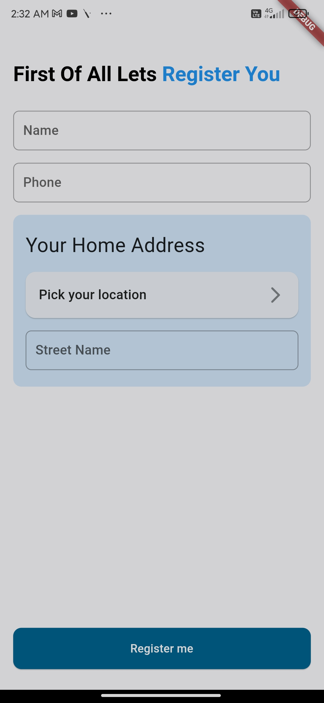
     &ensp; &ensp;
 

  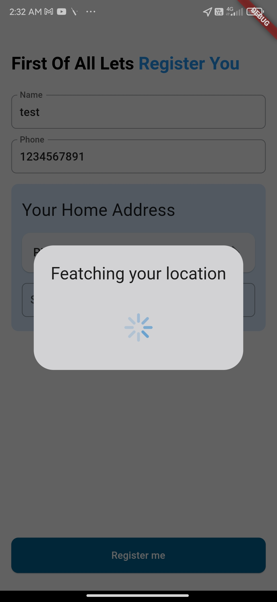
     &ensp; &ensp;
 

  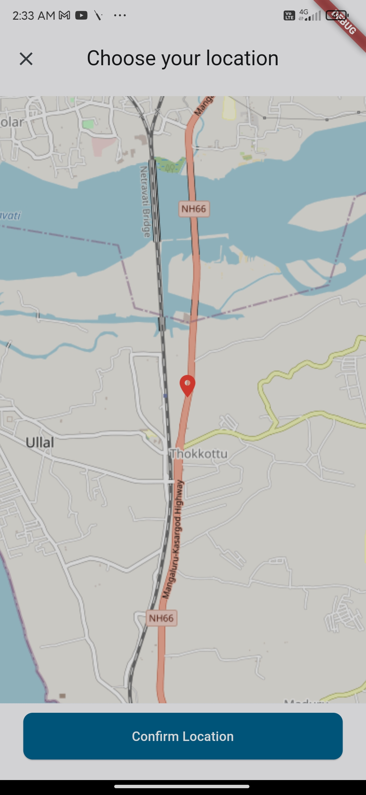
     &ensp; &ensp;
 

  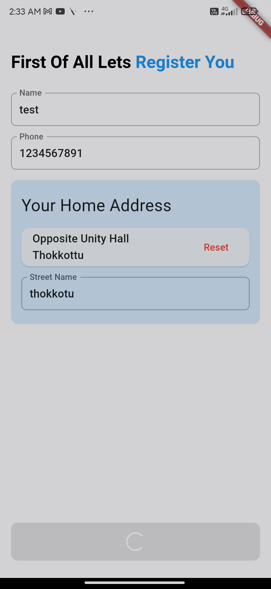
     &ensp; &ensp;
 

### App home page
#### user location picking bottom sheet in home page

  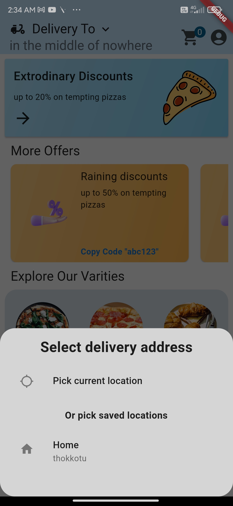
     &ensp; &ensp;
 

#### home page

   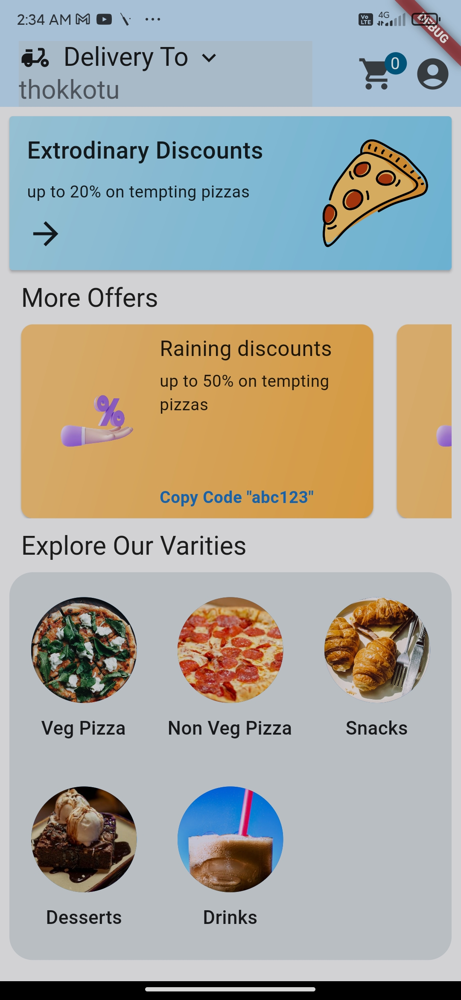
     &ensp; &ensp;
 

   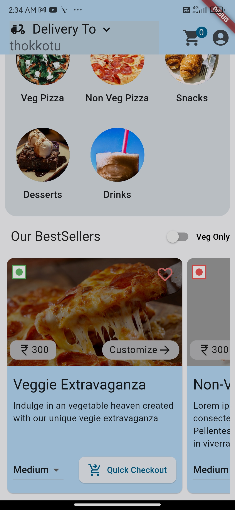
     &ensp; &ensp;
 

#### resturant not found page

   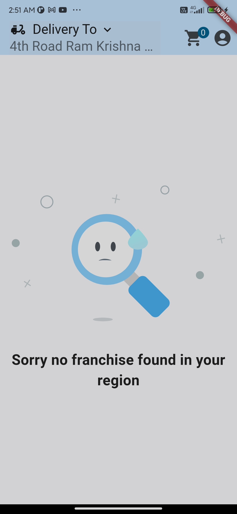
     &ensp; &ensp;
 

### Offer picking system
#### pick offer based on cart price

   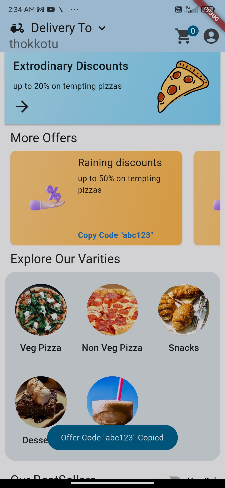
     &ensp; &ensp;
 

#### pick offer based on selected  items available with this offer  

   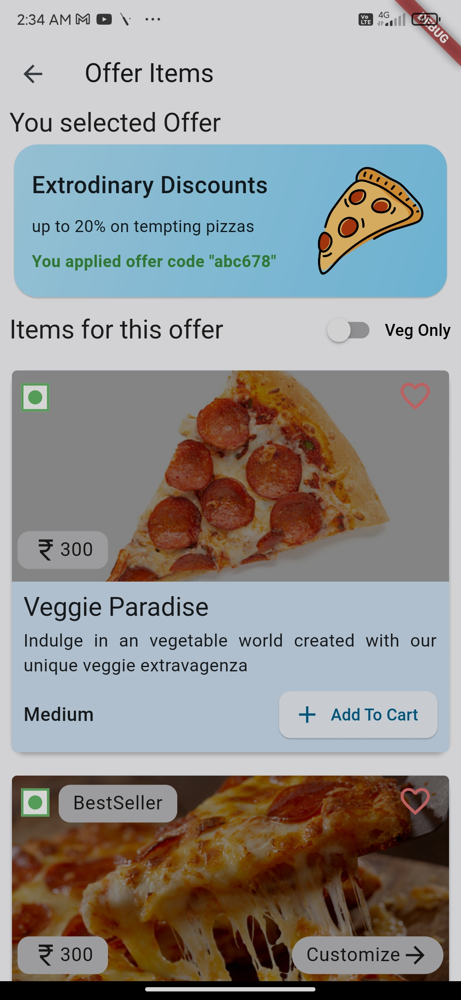
     &ensp; &ensp;
 

### View item by category page 

   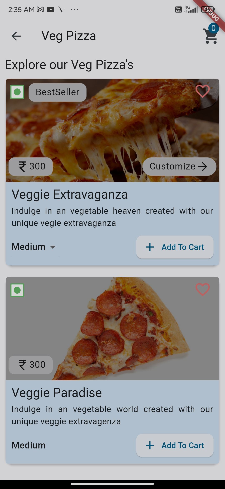
     &ensp; &ensp;
 

   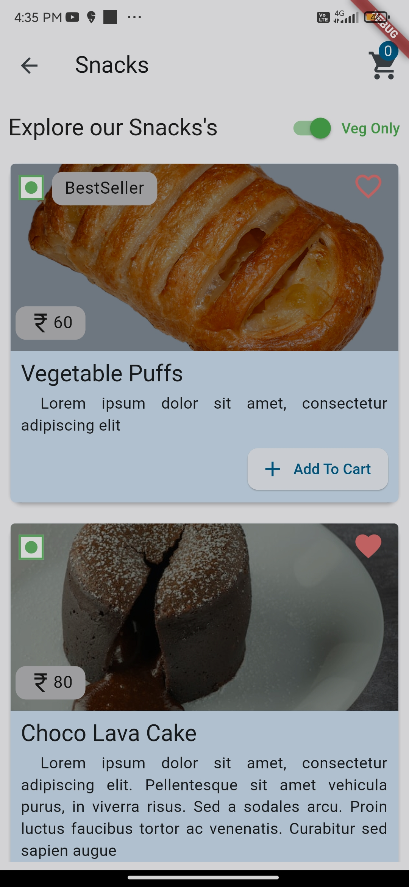
     &ensp; &ensp;
 

   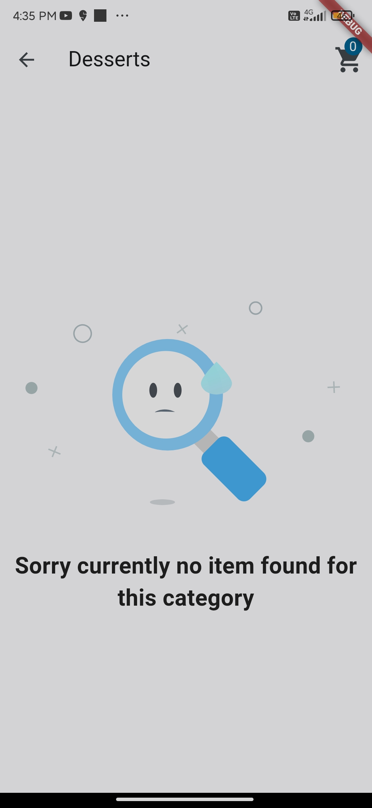
     &ensp; &ensp;
 

### Pizza customization page

   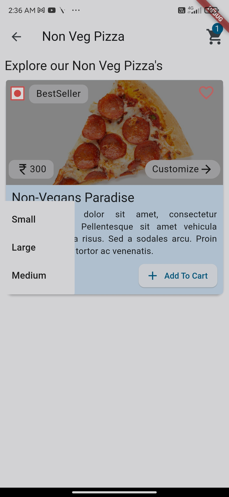
     &ensp; &ensp;
 

   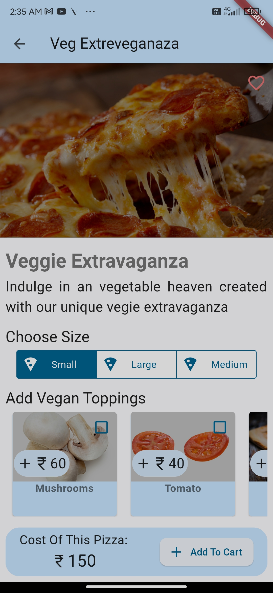
     &ensp; &ensp;
 

   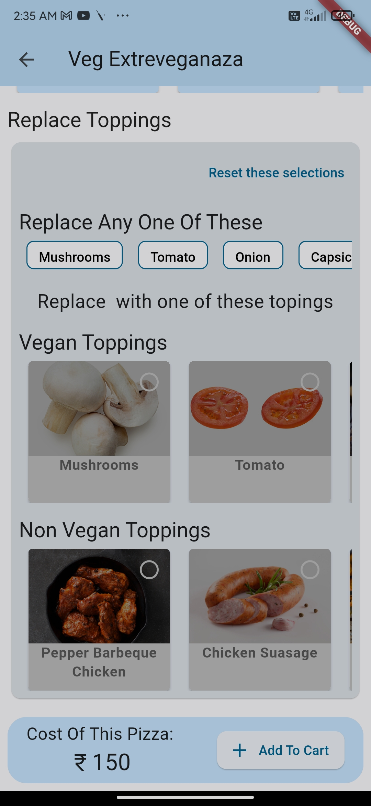
     &ensp; &ensp;
 

   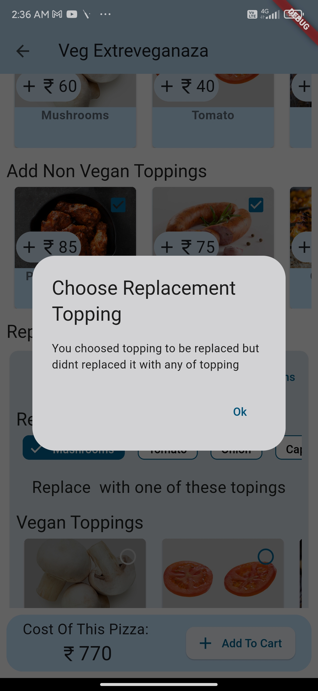
     &ensp; &ensp;
 

   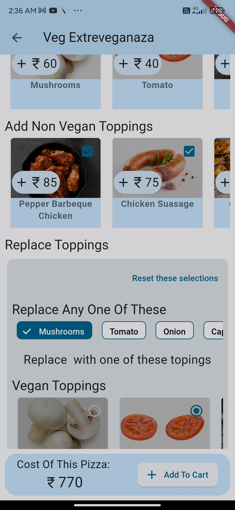
     &ensp; &ensp;
 

   
     &ensp; &ensp;
 

